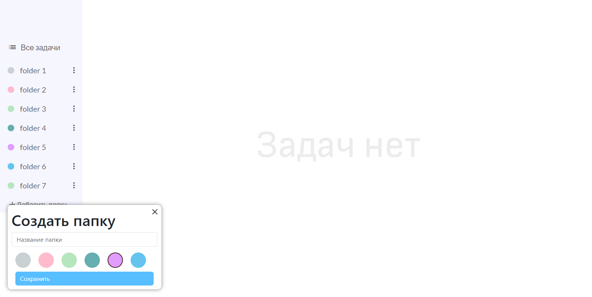
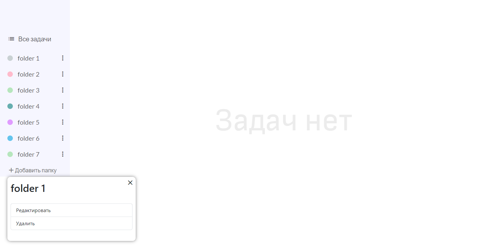

## Project setup
```
npm install
```

### Compiles and hot-reloads for development
```
npm run serve
```
### Start server
in 'backend-template':
```
npm i
```
then
```
npm run start 
```
Это относительно полноценный проект Planer, в котором реализованы методы CRUD
(Create, Read, Update, Delete). На JavaScript выполнена серверная часть с подключением к базе данных PostgreSQL.
Фронт реализован с помощью фреймворка Vue.js

Ниже представлены скриншоты моего веб-приложения.


Главный экран приложения, пользователь ещё не создал ни одной папки.


Форма создания папки.


Созданные папки


Форма добавления.


Реализация CRUD
Create - 2,4 pics;
Read - происходит при подключенном сервере в хуке created асинхронной функцией с get-запросом к БД;
Update & Delete  - форма всплывает при нажатии на значок 'more' у нужной папки.

На скриншотах можно увидеть визуальную часть проекта, он не доделан, находится в стадии разработки.
На данный момент работает добавление, редактирование и удаление папок,
в планах продолжить данный pet-project в рамках своего интереса и сделать CRUD для заданий как это показано на макете Figma:

https://www.figma.com/file/OP7oFTNqV8tPZyh2zSgCaX/Todo-ReactJS?type=design&node-id=5-233&mode=design

(при не работающей ссылке см. папку 'maket')
